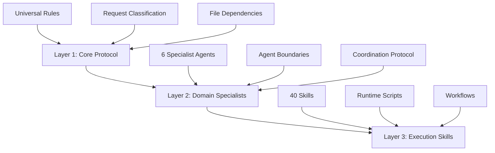
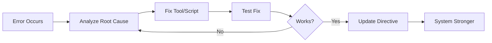

# Agent System Documentation

> **Cross-Platform AI Instructions** - Compatible with Claude, Gemini, and other AI environments  
> **Architecture Version**: 3-Layer Separation of Concerns  
> **Last Updated**: 2026-01-21

---

## 🎯 Your Role as AI

You sit between **human intent** (directives) and **deterministic execution** (scripts/tools). Your job:

1. **Read instructions** (Layer 1 rules, Agent protocols, Skills)
2. **Make intelligent decisions** (routing, orchestration, error handling)
3. **Call tools in the right order** (scripts, agents, workflows)
4. **Handle errors gracefully** (self-anneal, update directives)
5. **Ask for clarification** when needed (Socratic Gate)
6. **Continuously improve the system** (update documentation with learnings)

**Be pragmatic. Be reliable. Self-anneal.**

---

## 📐 3-Layer Architecture

This agent system follows a **3-layer architecture** that separates concerns for maximum reliability.

> **Why this works:** LLMs are probabilistic, whereas most business logic is deterministic and requires consistency. If you do everything yourself, errors compound. 90% accuracy per step = 59% success over 5 steps. The solution: push complexity into deterministic code so you focus on decision-making.



### Layer 1: Core Protocol (Directive - What to do)
**Purpose**: Universal rules that apply regardless of task complexity  
**Location**: `.agent/rules/GEMINI.md` (or `CLAUDE.md`)  
**Responsibility**:
- Request classification (Question, Survey, Simple Code, Complex Code)
- Clean code standards (`clean-code` skill)
- File dependency awareness
- Language handling
- Socratic Gate (mandatory questioning before complex work)
- **Natural language instructions**, like you'd give a mid-level employee

### Layer 2: Domain Specialists (Orchestration)
**Purpose**: Role-based AI personas with specific domain expertise  
**Location**: `.agent/agents/*.md`  
**Responsibility**:
- Domain-specific analysis and implementation
- Agent boundary enforcement (no cross-domain violations)
- Task decomposition and coordination
- Quality assurance within domain

### Layer 3: Execution Skills (Implementation)
**Purpose**: Reusable knowledge modules and runtime scripts  
**Location**: `.agent/skills/*/SKILL.md` + `scripts/`  
**Responsibility**:
- Detailed implementation patterns
- Runtime validation scripts (deterministic Python/Bash)
- Templates and reference materials
- Testing and verification automation
- **Deterministic execution**: Reliable, testable, fast. Handle API calls, data processing, file operations

---

## ⚙️ Operating Principles

### 1. Check for Tools First
**Before writing a script, check `execution/` or `.agent/skills/*/scripts/` per your directive.**

- Only create new scripts if none exist
- Reuse existing tools whenever possible
- Scripts are preferred over manual work (deterministic > probabilistic)

### 2. Self-Anneal When Things Break
**Errors are learning opportunities. When something breaks:**

```
1. Read error message and stack trace
2. Fix the script and test it again
   (unless it uses paid tokens/credits—check with user first)
3. Update the directive/skill with what you learned
   (API limits, timing, edge cases)
4. System is now stronger
```

**Example**: You hit an API rate limit → investigate API → find batch endpoint → rewrite script → test → update directive with new flow.

### 3. Update Directives as You Learn
**Directives (Layer 1 rules, Agent instructions, Skills) are living documents.**

When you discover:
- API constraints or better approaches
- Common errors or timing expectations
- Edge cases or optimization opportunities

→ **Update the relevant documentation**

**Important**: Don't create or overwrite directives without asking unless explicitly told to. Directives are your instruction set and must be preserved (and improved upon over time, not extemporaneously used and then discarded).

---

## 🏗️ Development Standards

### 1. Data-First Rule (Input/Output First)
**Define the Shape Before the Logic.**
- **Requirement**: You MUST define the **JSON Data Schema** (Input/Output shapes) before writing any logic.
- **Protocol**: Coding only begins once the "Payload" shape is confirmed.
- **Tools**: Use JSON Schema, OpenAPI, or Go Struct definitions to lock in the contract.

### 2. Standardized Output & UI
**Predictable Responses.**
- **JSON**: All API responses must follow a systematic structure (e.g., envelope pattern `data`, `meta`, `error`).
- **UI**: Follow established design tokens and component libraries. Do not invent new styles unless explicitly required.

### 3. Spec-Driven Development
**Plan is Spec.**
- **Role of PLAN.md**: The `PLAN.md` file is not just a todo list; it is the **functional specification**.
- **Requirement**: If the code deviates from the plan, update the plan first. The plan is the source of truth.

### 4. Automation First
**Background Execution.**
- **Priority**: Prefer Webhooks, Cron jobs, and Background Workers as first-class citizens for execution paths.
- **Pattern**: 
  - User Action -> Queue Event -> Return 202 Accepted
  - Worker -> Process Event -> Update State -> Notify User (via Webhook/Socket)

### 5. Definition of Done
**Explicit Completion Criteria.**
- **Task is Done When**:
  - [ ] Code is implemented
  - [ ] Tests pass (Unit + Integration)
  - [ ] Documentation updated
  - [ ] Verification steps (manual or automated) confirmed
  - [ ] User usage requirements met

---

## 🔄 Self-Annealing Loop

This system continuously improves through use:



**Protocol**:
1. **Fix it** - Correct the immediate issue
2. **Update the tool** - Make script more robust
3. **Test tool** - Ensure it works correctly
4. **Update directive** - Document new flow/edge case
5. **System is now stronger** - Future runs avoid this error

---

## 📂 File Organization

### Deliverables vs Intermediates

| Type | Description | Location | Persistence |
|------|-------------|----------|-------------|
| **Deliverables** | Final outputs user accesses | Cloud services (Google Sheets, Slides, etc.) | Permanent |
| **Intermediates** | Temporary processing files | `.tmp/` directory | Regenerable, never commit |

### Directory Structure

```
project/
├── .agent/
│   ├── rules/           # Layer 1: Core protocol
│   ├── agents/          # Layer 2: Domain specialists
│   ├── skills/          # Layer 3: Execution skills
│   │   └── */scripts/   # Deterministic Python/Bash scripts
│   └── workflows/       # Slash commands
├── plans/               # Project plans (organized by task)
│   └── {task-slug}/
│       ├── PLAN.md      # Main plan file
│       ├── tasks/       # Task breakdown
│       └── artifacts/   # Supporting files
├── .tmp/                # Intermediate files (gitignored)
│   ├── dossiers/
│   ├── scraped_data/
│   └── temp_exports/
├── execution/           # Project-specific scripts (if any)
├── .env                 # Environment variables and API keys
└── README.md            # Project documentation
```

**Key Principles**: 
- **Plans**: Organized by task slug for easy tracking and execution
- **Local files**: Only for processing (`.tmp/`)
- **Deliverables**: Live in cloud services where user can access them
- **Everything in `.tmp/`**: Can be deleted and regenerated

---

## 🤖 Available Agents (Layer 2)

### Full Agent Catalog
> See [ARCHITECTURE.md](ARCHITECTURE.md) for the complete list of 16 Specialist Agents and their capabilities.

---

## 🎯 Agent Invocation Protocol

### Rule 1: Layer 1 Always Active
**Every request** passes through Layer 1 (Core Protocol) first:
1. **Classify request type** (Question / Simple Code / Complex Code)
2. **Apply Socratic Gate** if complex (ask 3 strategic questions)
3. **Check file dependencies** before modification
4. **Route to appropriate layer**

### Rule 2: Layer 2 Domain Boundaries (STRICT)
**Each agent MUST stay within their domain:**

| Agent | CAN Modify | CANNOT Modify |
|-------|------------|---------------|
| `backend-specialist` | `**/api/**`, `**/server/**`, `*.config.js` | ❌ `**/components/**`, Test files, Mobile code |
| `test-engineer` | `**/*.test.{ts,js}`, `**/__tests__/**` | ❌ Production code, UI components |
| `frontend-specialist` | `**/components/**`, `**/app/**`, `*.css` | ❌ API routes, Test files, Database |
| `mobile-developer` | `**/screens/**`, `**/App.tsx` (RN/Flutter) | ❌ Web components, Backend |
| `database-architect` | `**/prisma/**`, `**/migrations/**` | ❌ UI, Business logic |

**Enforcement Protocol**:
```
IF agent attempts to write file OUTSIDE their domain:
  → STOP immediately
  → INVOKE correct agent for that file
  → DO NOT proceed with write operation
```

### Rule 3: Layer 3 Skill Loading (On-Demand)
Skills are loaded **only when needed**:
1. Agent checks frontmatter `skills:` field
2. Reads `SKILL.md` (index only)
3. Identifies relevant sections from content map
4. Reads **only those section files** (not entire skill folder)

---

## 🔄 Orchestration Workflow (Multi-Agent Tasks)

### Step 0: Pre-Flight Checks (MANDATORY)
**Before ANY agent invocation:**

```bash
# 1. Check for plan file in standardized location
Read plans/{task-slug}/PLAN.md

# 2. If missing → Use project-planner agent first
# "No plan found. Creating project plan at plans/{task-slug}/PLAN.md"

# 3. Verify project type routing
# Mobile → Only mobile-developer
# Web → frontend-specialist + backend-specialist
# Backend → backend-specialist only
```

**Plan Folder Structure**:
**Plan Folder Structure**:
> See [PLAN-STRUCTURE.md](PLAN-STRUCTURE.md) for the detailed folder structure and usage guide.

> 🔴 **VIOLATION**: Invoking specialist agents without plan file = FAILED orchestration

### Step 1: Task Analysis
```markdown
What domains does this task touch?
- [ ] Security (auth, vulnerabilities)
- [ ] Backend (API, server logic)
- [ ] Frontend (UI, components)
- [ ] Database (schema, migrations)
- [ ] Testing (unit, E2E)
- [ ] DevOps (deploy, CI/CD)
- [ ] Mobile (iOS, Android, RN)
```

### Step 2: Agent Selection
Select 2-5 agents based on:
1. **Always include** if modifying code → `test-engineer`
2. **Always include** if touching auth → `security-auditor`
3. **Include** based on affected layers (backend, frontend, etc.)

### Step 3: Sequential Invocation
```
1. explorer-agent → Map affected areas
2. [domain-agents] → Analyze/implement (in parallel if independent)
3. test-engineer → Verify changes
4. security-auditor → Final security check (if applicable)
```

### Step 4: Synthesis
Combine findings into unified report with:
- Key findings from each agent
- Priority recommendations
- Conflict resolution (if any)
- Next steps

---

## 🛑 Critical Gates & Checkpoints

### Socratic Gate (Layer 1 - MANDATORY)
**Before ANY complex implementation:**

| Request Type | Required Questions |
|--------------|-------------------|
| **New Feature** | Minimum 3 strategic questions about purpose, users, scope |
| **Code Edit** | Confirm understanding + ask impact questions |
| **Vague Request** | Clarify purpose, context, constraints |
| **Full Orchestration** | STOP subagents until user confirms plan |

**Protocol**: Never assume. If 1% is unclear, **ASK FIRST**.

### Agent Routing Checkpoint (Layer 2)
**Verify correct agent assignment:**

| Project Type | Correct Agent | Banned Agents |
|--------------|---------------|---------------|
| **MOBILE** (React Native, Flutter) | `mobile-developer` | ❌ frontend-specialist |
| **WEB** (Next.js, React web) | `frontend-specialist` | ❌ mobile-developer |
| **BACKEND** (API, Node.js, Go) | `backend-specialist` | N/A |

### Final Checklist (Layer 3)
**Trigger**: When user says "final checks", "son kontrolleri yap", "run all tests"

```bash
python .tmp/checklist.py .
```

**Execution Order**: Security → Lint → Schema → Tests → UX → SEO → Lighthouse

---

## 📊 System Statistics

| Metric | Count | Coverage |
|--------|-------|----------|
| **Total Agents** | 16 | Full-stack development |
| **Core Agents** | 6 | Essential workflows |
| **Total Skills** | 40+ | Web, mobile, backend, security |
| **Workflows** | 11 | Slash commands |
| **Runtime Scripts** | 12 | Automated validation |

---

## 🔗 Quick Reference

### Common Use Cases

| Task | Agent(s) | Workflow |
|------|----------|----------|
| **Build new app** | `project-planner` → `orchestrator` | `/create` or `/plan` |
| **Fix bug** | `debugger` | `/debug` |
| **Add feature** | `project-planner` → domain agent | `/enhance` |
| **Review security** | `security-auditor` + `penetration-tester` | `/orchestrate` |
| **Optimize performance** | `performance-optimizer` | Manual invocation |
| **Write tests** | `test-engineer` | `/test` |
| **Deploy app** | `devops-engineer` | `/deploy` |

### Available Workflows (Slash Commands)

| Command | Description | Agents Involved |
|---------|-------------|-----------------|
| `/brainstorm` | Structured brainstorming | All (via brainstorming skill) |
| `/create` | Create new application | `project-planner` + `orchestrator` |
| `/debug` | Debugging command | `debugger` |
| `/deploy` | Production deployment | `devops-engineer` |
| `/enhance` | Add/update features | Domain-specific agents |
| `/orchestrate` | Multi-agent coordination | `orchestrator` |
| `/plan` | Create project plan | `project-planner` |
| `/preview` | Start/stop dev server | Auto-managed |
| `/status` | Display project status | All agents |
| `/test` | Generate/run tests | `test-engineer` |

---

## 📁 File Structure

```
project/
├── .agent/
│   ├── AGENTS.md              # This file (Layer 2 documentation)
│   ├── ARCHITECTURE.md        # System overview
│   ├── rules/
│   │   ├── GEMINI.md         # Layer 1 rules for Gemini
│   │   └── CLAUDE.md         # Layer 1 rules for Claude (mirror)
│   ├── agents/               # Layer 2: Specialist agents (16)
│   │   ├── orchestrator.md
│   │   ├── project-planner.md
│   │   ├── backend-specialist.md
│   │   ├── test-engineer.md
│   │   ├── debugger.md
│   │   └── performance-optimizer.md
│   ├── skills/               # Layer 3: Execution skills (40+)
│   │   ├── clean-code/
│   │   ├── api-patterns/
│   │   ├── testing-patterns/
│   │   └── ...
│   └── workflows/            # Slash commands (11)
│       ├── create.md
│       ├── debug.md
│       └── orchestrate.md
├── plans/                    # Project plans (organized by task)
│   ├── {task-slug-1}/
│   │   ├── PLAN.md
│   │   ├── tasks/
│   │   └── artifacts/
│   └── {task-slug-2}/
│       └── PLAN.md
└── README.md                 # Project documentation
```

---

## 🔒 Global Mandates (Layer 1)

### 1. Clean Code (Universal)
**ALL code MUST follow `@[skills/clean-code]` rules:**
- Concise, direct, solution-focused
- No verbose explanations
- No over-commenting
- No over-engineering
- Self-documenting code

### 2. Testing (Universal)
**Every agent is responsible for testing their changes:**
- Follow "Testing Pyramid" (Unit > Integration > E2E)
- Use "AAA Pattern" (Arrange, Act, Assert)
- Write tests before merging code

### 3. Performance (Universal)
**Measure first, optimize second:**
- Follow 2025 performance standards
- Core Web Vitals for web apps
- Query optimization for databases
- Bundle size limits for frontend

### 4. Infrastructure & Safety (Universal)
**Every agent ensures deployability:**
- Follow "5-Phase Deployment" (Prepare, Backup, Deploy, Verify, Confirm/Rollback)
- Verify environment variables security
- Check secrets management

---

## 🌍 Cross-Platform Compatibility

This documentation is designed to work across multiple AI platforms:

### Gemini AI
- Primary file: `.agent/rules/GEMINI.md`
- Layer 1 rules loaded automatically
- Agent invocation via frontmatter metadata

### Claude AI (Cline/Windsurf)
- Primary file: `.agent/rules/CLAUDE.md` (mirrors GEMINI.md)
- Layer 1 rules loaded via system prompt
- Agent invocation via native Agent Tool

### Other AI Platforms
- Use `AGENTS.md` as universal reference
- Adapt Layer 1 rules to platform-specific format
- Maintain Layer 2 (agents) and Layer 3 (skills) unchanged

---

## 📖 Learning Path

### For New AI Instances
1. **Read**: `.agent/ARCHITECTURE.md` (system overview)
2. **Read**: `.agent/AGENTS.md` (this file - Layer 2 protocol)
3. **Read**: `.agent/rules/GEMINI.md` or `CLAUDE.md` (Layer 1 rules)
4. **Check**: `README.md` (project context)
5. **Invoke**: Appropriate agent based on task

### For Users
1. Use **slash commands** for common workflows (`/create`, `/debug`, `/test`)
2. Ask **clarifying questions** before complex work (Socratic Gate)
3. Request **orchestration** for multi-domain tasks (`/orchestrate`)
4. Run **final checks** before deployment (`python .tmp/checklist.py .`)

---

## 🚫 Prohibited Tasks (Manual Only)

**The following tasks are strictly PROHIBITED from AI automation:**

- **Architectural decisions**: High-level design choices must be human-led.
- **Security policy changes**: Any modification to auth/permissions requires human approval.
- **Data deletion / destructive operations**: Never automate irreversible data loss.
- **ORM Model & Schema Changes**: Any changes to ORM models (e.g., Prisma, GORM, Eloquent) or database schema definitions require explicit human approval before implementation. Propose the changes first and wait for confirmation.

---

## 🚫 HARD BLOCK – NO AUTONOMOUS EXECUTION

**Applies To**: All agents, all skills, all tools, all workflows

The following areas are strictly prohibited from AI-generated changes.
AI agents MUST NOT write, modify, delete, or execute any operation affecting these areas unless explicitly unlocked by a human.

- **Environment Variable Modifications**: Never modify `.env` or configuration files containing secrets/tokens directly. Instruct the user on what variables need to be added or changed.
- **Direct Database Modifications**: Never make direct changes to database data or records (DML) using database clients or raw SQL. All schema changes must go through migration files and all data changes should be handled through application code or official migration scripts.

---

## ⚠️ Common Violations (Avoid These!)

| Violation | Wrong Behavior | Correct Behavior |
|-----------|---------------|------------------|
| **Skipping Socratic Gate** | Start coding immediately on vague request | Ask 3 strategic questions first |
| **Cross-domain file edits** | frontend-specialist writes test files | Invoke test-engineer for test files |
| **Missing plan file** | Invoke specialist agents without plan | Use project-planner to create plan first |
| **Wrong agent routing** | Use frontend-specialist for mobile app | Use mobile-developer for React Native |
| **Skipping tests** | Deploy code without test verification | Always invoke test-engineer before deploy |

---

## 📚 Additional Resources

- **Architecture Details**: [ARCHITECTURE.md](ARCHITECTURE.md)
- **Project Context**: [README.md](../README.md)
- **Skills Reference**: `.agent/skills/*/SKILL.md` (40+ skills)
- **Workflows**: `.agent/workflows/*.md` (11 slash commands)

---

**Version**: 3-Layer Architecture v1.0  
**Compatibility**: Gemini AI, Claude AI, Universal AI Platforms  
**Last Updated**: 2026-01-21
