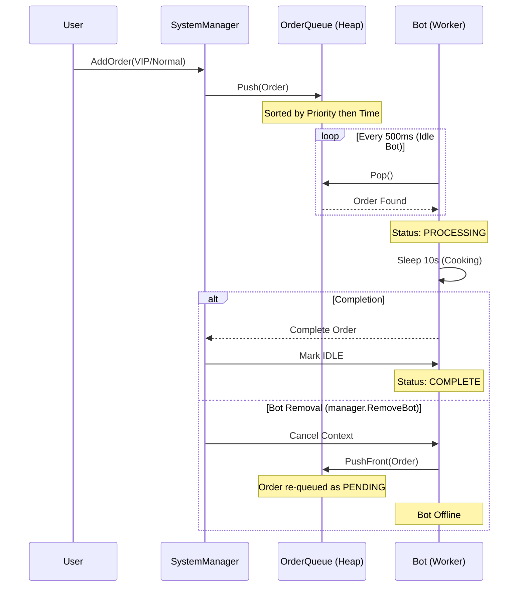

# Project Documentation: McDonald's Order Controller - FeedMe Software Engineer Assignment

This document provides a technical overview of the McDonald's Order Controller backend, explaining the architecture, implementation methodology, and operational flows.

## 1. Features Overview

- **Priority-Based Processing**: High-priority (VIP) orders automatically take precedence in the pending queue using a thread-safe heap implementation.
- **Dynamic Bot Management**: Bots (workers) can be added or removed on the fly. Removing a bot safely returns its currently processing order to the front of the queue.
- **Randomized Bot IDs**: Each bot is uniquely identified by a 6-character alphanumeric string (e.g., `OyGPzP`).
- **Domain-Driven Statistics**: System status metrics (Total, Completed, Pending, Active Bots) are sourced directly from the respective `order` and `bot` domain packages.
- **Traceable Logging**: Two-tier logging system providing timestamped event logs (`utils.Log`) and raw status reports (`utils.LogRaw`).
- **Comprehensive Testing**: Unit tests covering core domain logic and integration tests for the `SystemManager`.
- **CI/CD Integration**: Fully compatible with GitHub Actions (`go-verify-result` workflow) for automated verification.

---

## 2. Implementation Methodology

### Architecture
The project follows a **Modular Monolith** structure, separating concerns into distinct packages:
- `cmd/main.go`: Entry point and simulation orchestration.
- `internal/manager`: Coordination layer (`SystemManager`) that bridges orders and bots.
- `internal/order`: Domain logic for order models, priority queue management, and statistics.
- `internal/bot`: Domain logic for bot workers, pool management, and concurrent processing.
- `internal/utils`: Low-level utilities for logging, timestamping, and ID generation.

### Concurrency Model
The system uses Go's concurrency primitives to manage bot workers:
1. **Goroutines**: Each bot runs in its own goroutine (`botLoop`).
2. **Contexts**: `context.Context` is used to signal bot shutdown. When a bot is removed, its context is cancelled, triggering a graceful exit from its processing loop.
3. **Mutexes**: Thread-safety is ensured across the `Queue`, `Pool`, and `SystemManager` using `sync.Mutex` to prevent race conditions during order popping and bot registration.

### Priority Queue
Orders are managed using a **Min-Heap** (implemented via `container/heap`). The priority is determined by:
1. **Order Type**: VIP (Priority 20) vs Normal (Priority 10). Higher numerical priority comes first.
2. **First-In-First-Out (FIFO)**: For orders with the same priority, the `CreatedAt` timestamp is used as the tie-breaker.

---

## 3. Process Flow

The following diagram illustrates the lifecycle of an order from submission to completion:



---

## 4. Verification

### Automated Verification
Run the following script from the root directory to perform a full build, test, and simulation sequence:
```bash
./scripts/test.sh && ./scripts/build.sh && ./scripts/run.sh
```

### Manual Audit
The execution results are saved to `scripts/result.txt`. Every log entry follows the required `[HH:MM:SS]` timestamp format to allow precise tracking of order processing times.
