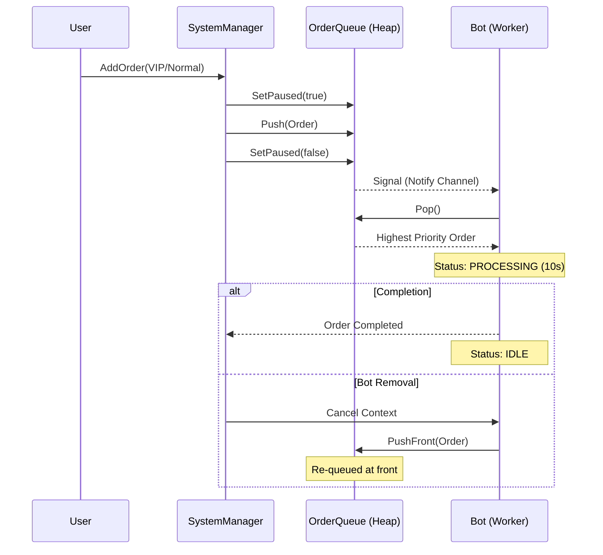

# Project Documentation: McDonald's Order Controller - FeedMe Software Engineer Assignment

This document provides a technical overview of the McDonald's Order Controller backend, explaining the architecture, implementation methodology, and operational flows.

---

## 1. Features Overview

- **Priority-Based Orchestration**: High-priority (VIP) orders automatically take precedence using a thread-safe heap implementation.
- **Strict FIFO Logic**: Uses a three-tier comparison for order retrieval:
    1. **Priority Tier** (VIP vs. Normal)
    2. **Submission Time** (CreatedAt timestamp)
    3. **Order ID** (Strict tie-breaker for simultaneous arrivals)
- **Signaling Worker Pattern**: Bots use a signaling mechanism (`Notify` channel) to wake up immediately when work is available, eliminating inefficient polling.
- **Batch Processing Support**: Includes a `Paused` state to freeze assignment while large batches of orders are being submitted, ensuring the full priority list is respected.
- **Dynamic Bot Pool**: Bots can be added or removed at runtime. Removing a bot safely returns its in-progress order to the front of the queue.
- **Traceable Logging**: Millisecond-precision timestamps (`15:04:05.000`) for debugging concurrent race conditions.

---

## 2. Implementation Methodology

### Architecture
The project follows a modular structure to separate concerns:
- `cmd/main.go`: Entry point and simulation orchestration.
- `internal/manager`: Coordination layer (`SystemManager`) bridging orders and bots.
- `internal/order`: Domain logic for models, priority queue, and statistics.
- `internal/bot`: Domain logic for bot workers and lifecycle management.
- `internal/event`: Simple Pub/Sub EventBus for system decoupling.
- `internal/utils`: Low-level utilities for logging, timestamping, and ID generation.

### Concurrency Model
The system uses Go's internal primitives to manage high-concurrency:
1. **Goroutines**: Each bot runs in its own lightweight thread.
2. **Contexts**: Used for clean shutdown and cancellation of processing tasks.
3. **Mutexes**: Ensures memory integrity when multiple bots access the queue or shared statistics.

---

## 3. Production Readiness Note

The current implementation is a **custom in-memory task queue** designed as a high-performance prototype for CLI simulations. 

For a production-grade environment, it is recommended to replace the internal `order.Queue` with a robust distributed task queue library:
- **Asynq** (based on Redis)
- **Machinery** (supporting RabbitMQ or Redis)

These libraries provide essential features like persistent storage, cross-server scaling, automatic retries, and dead-letter queues that are necessary for real-world mission-critical systems.

---

## 3. Process Flow

The following diagram illustrates the lifecycle of an order and how bots react to system signals rather than polling:



---

## 4. Component Breakdown

### Priority Queue (`internal/order/queue.go`)
Implements `heap.Interface`. The comparison logic ensures that VIP orders are always at the top. If two orders arrive at the exact same millisecond, the one with the lower ID is processed first.

### Bot Worker (`internal/bot/worker.go`)
Simulates a 10-second cooking cycle. It is designed to be cancellable; if the bot is removed during those 10 seconds, it gracefully stops the timer and pushes the order back to the pending queue.

### Event Bus (`internal/event/eventbus.go`)
A non-blocking event broadcaster. Channels have a buffer of 10 slots; if a consumer is too slow, the bus skips the event for that consumer to prevent stalling the entire simulation.

---

## 5. Verification

### Automated Verification
Run the following command to execute the full suite of unit tests, including stability tests for identical timestamps and concurrency:
```bash
go test -v ./...
```

### Simulation
Build and run the simulation using the provided scripts:
```bash
./scripts/build.sh && ./scripts/run.sh
```
The results, including millisecond-precise logs, will be available in `scripts/result.txt`.

